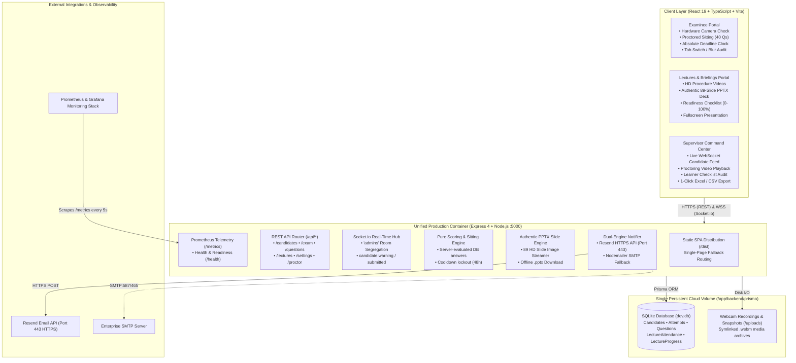

# Workplace Training, Examination & Proctoring Platform

[](https://www.typescriptlang.org/)
[](https://react.dev/)
[](https://nodejs.org/)
[](https://expressjs.com/)
[](https://www.prisma.io/)
[](https://www.docker.com/)
[](https://mofarreh-exam-system.up.railway.app)
[](https://github.com/Youssef22Ashraf/exam-sys/actions/workflows/ci.yml)
[](https://github.com/Youssef22Ashraf/exam-sys/releases/tag/v2.0.0)
[](https://aquasecurity.github.io/trivy/)
[](monitoring/README.md)

An enterprise-grade, web-based examination, learning, and proctoring platform engineered to train and evaluate workplace and industrial competency before granting site or operational access. Features an interactive **Workplace Lectures & Briefings Portal** with authentic high-definition PowerPoint slide deck streaming and procedure readiness checklists, live webcam recording with IndexedDB chunk streaming, window/tab blur auditing, department identity management, multi-attempt tracking with 48-hour retest lockouts, dual-engine email delivery (Resend HTTPS + SMTP fallback), dynamic administrative exam orchestration, global high-contrast Dark & Light theme engine, containerized CVE auditing, and native Prometheus/Grafana observability.

---

## Live Production Links

| Service | Public URL | Description |
|---|---|---|
| **Examinee Portal** | [`https://mofarreh-exam-system.up.railway.app/`](https://mofarreh-exam-system.up.railway.app/) | Candidate registration, hardware check, timed exam & certificate |
| **Lectures & Briefings Portal** | [`https://mofarreh-exam-system.up.railway.app/#lectures`](https://mofarreh-exam-system.up.railway.app/#lectures) | Interactive video briefings, authentic slide deck viewer, procedure checklist |
| **Admin Command Center** | [`https://mofarreh-exam-system.up.railway.app/admin`](https://mofarreh-exam-system.up.railway.app/admin) | Supervisor live oversight, lecture attendance audit, question editor, video stream review |
| **Health Probe** | [`https://mofarreh-exam-system.up.railway.app/health`](https://mofarreh-exam-system.up.railway.app/health) | Liveness & readiness probe with DB connectivity status |
| **Prometheus Metrics** | [`https://mofarreh-exam-system.up.railway.app/metrics`](https://mofarreh-exam-system.up.railway.app/metrics) | Standard Prometheus scrape target for telemetry |

---

## Table of Contents

- [System Design & Architecture](#system-design--architecture)
- [Workflow & Candidate Lifecycle](#workflow--candidate-lifecycle)
- [Key Features](#key-features)
  - [Interactive Workplace Lectures & Briefings Portal (`/#lectures`)](#interactive-workplace-lectures--briefings-portal-lectures)
  - [Examinee Experience & Assessment Flow](#examinee-experience--assessment-flow)
  - [Anti-Cheating & Proctoring Engine](#anti-cheating--proctoring-engine)
  - [48-Hour Cooldown & Multi-Attempt Enforcement](#48-hour-cooldown--multi-attempt-enforcement)
  - [Administrative Command Center (`/admin`)](#administrative-command-center-admin)
  - [Global Dark & Light Theme Engine](#global-dark--light-theme-engine)
  - [Dual-Engine Email Alerting System](#dual-engine-email-alerting-system)
  - [Single-Volume Persistence Architecture](#single-volume-persistence-architecture)
- [Directory Structure](#directory-structure)
- [Technology Stack](#technology-stack)
- [CI/CD & Container Security](#cicd--container-security)
- [Observability & Health Monitoring](#observability--health-monitoring)
  - [Health Probe (`GET /health`)](#1-health-probe-get-health)
  - [Prometheus Metrics (`GET /metrics`)](#2-prometheus-metrics-get-metrics)
  - [Grafana Dashboard Setup](#3-running-prometheus--grafana-monitoring)
- [Environment Variables](#environment-variables)
- [Local Development Setup](#local-development-setup)
- [Production Deployment (Railway)](#production-deployment-railway)
- [Database Schema & Models](#database-schema--models)
- [Accessing the Platform](#accessing-the-platform)
- [License](#license)

---

## System Design & Architecture

### Interactive Architectural Overview



### Infrastructure & Runtime Topology

```text
┌──────────────────────────────────────────────────────────────────────────────────────────────────────────────────┐
│                                                   CLIENT LAYER                                                   │
│                                                                                                                  │
│   ┌────────────────────────────────┐  ┌────────────────────────────────┐  ┌──────────────────────────────────┐   │
│   │   Examinee Portal (React 19)   │  │   Lectures & Briefings Portal  │  │    Supervisor Command Center     │   │
│   │ - Department identity capture  │  │ - Video briefing + subtitles   │  │ - Live candidate WebSocket feed  │   │
│   │ - Interactive Camera Face Guide│  │ - Authentic 89-slide PPTX deck │  │ - Proctor video playback audit   │   │
│   │ - MediaRecorder + IndexedDB    │  │ - Procedure Readiness Checklist│  │ - Lectures & Attendance Audit    │   │
│   │ - Tab switch & blur detection  │  │ - Fullscreen presentation mode │  │ - Learner progress & Excel export│   │
│   │ - Absolute Deadline Clock      │  │ - Quick exam jump callout      │  │ - Question CRUD & Pass % Editor  │   │
│   └───────────────┬────────────────┘  └───────────────┬────────────────┘  └────────────────┬─────────────────┘   │
│                   │                                   │                                    │                     │
│                   └───────────────────────────────────┼────────────────────────────────────┘                     │
└───────────────────────────────────────────────────────┼──────────────────────────────────────────────────────────┘
                                                        │ HTTPS / REST / WebSockets
                                                        ▼
┌──────────────────────────────────────────────────────────────────────────────────────────────────────────────────┐
│                                     UNIFIED PRODUCTION CONTAINER (Port :5000)                                    │
│                                                                                                                  │
│   ┌──────────────────────────────────────────────────────────────────────────────────────────────────────────┐   │
│   │                                          Express 4 + TypeScript                                          │   │
│   │   - Static SPA Distribution (/dist) with single-page fallback routing                                    │   │
│   │   - Authenticated REST APIs (/api/candidates, /api/exam, /api/questions, /api/settings, /api/lectures)  │   │
│   │   - Authentic PowerPoint Slide Streamer (89 HD slide image renders + offline .pptx download)             │   │
│   │   - Learner Attendance & Heartbeat Engine (Tracks durations, playback events, and checklists)           │   │
│   │   - Server-Owned Exam Sessions (Deterministic clock, warning counter bank)                               │   │
│   │   - Pure Scoring Engine (Scores evaluated solely on server against DB keys)                              │   │
│   │   - Socket.io Server (Admins room segregation with JWT handshake verification)                           │   │
│   │   - Dual-Engine Notification Dispatcher (Resend HTTPS port 443 + Nodemailer SMTP)                       │   │
│   │   - Prometheus Telemetry & Liveness Engine (/health, /metrics)                                           │   │
│   └──────────────────────────────────────┬───────────────────────────────┬───────────────────────────────────┘   │
└──────────────────────────────────────────┼───────────────────────────────┼───────────────────────────────────────┘
                                           │                               │
                                           ▼                               ▼
                         ┌──────────────────────────────────────────────────────────────┐
                         │          SINGLE PERSISTENT VOLUME: /app/backend/prisma       │
                         │                                                              │
                         │   - dev.db (SQLite database: candidates, attempts, progress) │
                         │   - schema.prisma (Auto-restored from template on boot)      │
                         │   - uploads/ (Symlinked: webcam recordings & snapshots)      │
                         │                                                              │
                         │   * Fully survives redeployments and container restarts *    │
                         └──────────────────────────────────────────────────────────────┘
                                           ▲
                                           │ Scrapes `/metrics` every 5s
┌──────────────────────────────────────────┴───────────────────────────────────────────────────────────────────────┐
│                                        OBSERVABILITY & MONITORING STACK                                          │
│                                                                                                                  │
│   ┌──────────────────────────────────────────────┐          ┌────────────────────────────────────────┐           │
│   │              Prometheus (:9090)              │          │             Grafana (:3000)            │           │
│   │   - Scrapes Railway Production (:443)        │──────────▶   - Real-time Production Dashboards    │           │
│   │   - Scrapes Local Dev Container (:5000)      │          │   - Database Health, Memory Profiles   │           │
│   │   - Time-series metric retention & alerts    │          │   - WebSocket Concurrency & Latency    │           │
│   └──────────────────────────────────────────────┘          └────────────────────────────────────────┘           │
└──────────────────────────────────────────────────────────────────────────────────────────────────────────────────┘
```

### Architectural Decisions & Core Tenets

1. **Server Scores, Server Decides (ADR 008)**:
   - Question choices sent to the client **never contain `correctAnswer`**. The exam cannot be scored on the frontend.
   - Upon submission (`POST /api/exam/submit`), the backend scoring engine evaluates answers against DB rows, computes passing percentage, applies thresholds, and registers attempt numbers.
   - Proctoring warnings recorded on the client can only increase the server's warning tally (`max(client, server)`), never decrease it.
2. **Absolute Deadline Clock**:
   - The examination timer is an absolute server-anchored deadline timestamp, not a decrementing countdown counter.
   - Candidates cannot bypass the timer by pausing browser execution, switching tabs, or refreshing the page.
3. **Authentic Learning & Procedure Verification Engine**:
   - Training modules provide official high-definition PowerPoint slide deck streaming and synchronized subtitles alongside video briefings.
   - Procedure readiness is multi-factored: learners are tracked across video consumption, slide reviews, offline references, and key procedure takeaways.
4. **Single Process, Unified Port**:
   - Built via a multi-stage Docker container. The Express backend serves the pre-compiled React 19 SPA static assets alongside the API, WebSockets, and health checks on port `5000`.

---

## Workflow & Candidate Lifecycle

The platform enforces a strict, guided 6-step lifecycle for every examinee:

```text
[ 1. Registration ]
        │
        ▼
[ 2. Cooldown Gate ] ──(Under 48 Hours)──▶ [ Lockout Screen with Countdown ]
        │
    (Eligible)
        ▼
[ 3. Hardware & Rules Check ] ──(Camera Inactive or Checkboxes Unchecked)──▶ [ Gated / Blocked ]
        │
 (All Verified)
        ▼
[ 4. Proctored Exam Sitting ]
  ├── Real-time webcam video recording (IndexedDB chunking)
  ├── Tab-switch & focus loss auditing
  └── Server-anchored countdown timer
        │
        ▼
[ 5. Server Submission & Scoring ]
  ├── Automatic snapshot & WebM video upload
  ├── Server evaluates score against DB question keys
  └── Instant breakdown certificate & armed 48-hour retest lock
        │
        ▼
[ 6. Automated Supervisor Notification ]
  ├── Resend HTTPS (Port 443) / SMTP Alert dispatched
  ├── Re-attempt detection with banner & score summary
  └── Admin link with 1-click candidate audit access
```

### Step 1: Candidate Registration (`/`)
- Candidates input **Full Name**, **Company Employee ID**, and **Work Email**.
- Basic client-side and server-side validation guarantees well-formed email addresses and trimmed identities.

### Step 2: 48-Hour Retest Cooldown Check
- Upon submitting credentials, `GET /api/candidates/check-cooldown?email=...&companyId=...` evaluates the candidate's history.
- If an attempt was submitted within the previous 48 hours, the candidate is immediately locked out.
- The lockout screen displays a live dynamic countdown showing the exact hours and minutes until eligibility opens, along with supervisor contact instructions.

### Step 3: Hardware Verification & Compliance Agreement (`/instructions`)
- **Live Webcam Preview**: Activates the candidate's camera with an ergonomic face-alignment guide overlay.
- **Continuous Video Verification**: Verifies media hardware stream binding so the examinee confirms their feed is clear (eliminating black-screen or permission issues before entry).
- **Mandatory 3-Point Rules Checklist**: The "Start Examination" button remains strictly disabled until the candidate manually verifies all conditions:
  1. *Camera Active & Visible*: Confirms face is centered in the live preview.
  2. *Single-Tab Policy*: Confirms all other tabs, messengers, and devtools are closed, acknowledging tab switches are audited in real time.
  3. *Video Footage Integrity*: Acknowledges that blank, obstructed, or bypassed video feeds disqualify the assessment.
- **Exam Commencement Alert**: When the candidate starts, the backend immediately records sitting metadata and fires an assessment-start email notification to management.

### Step 4: Proctored Assessment Sitting (`/exam`)
- **Server-Owned Session**: Initialized via `POST /api/exam/start`, returning an active session ID held in `sessionStorage` (allowing seamless reconnection on accidental reload).
- **Categorized Question Modules (40 Questions)**:
  - **Part A — Interface Management**: Evaluates cross-functional communication, operational protocols, and interface matrices.
  - **Part B — Stakeholder Management**: Evaluates client communications, escalation pathways, and stakeholder expectations.
- **Continuous Anti-Cheating Engine**:
  - Live webcam stream recorded continuously using HTML5 `MediaRecorder`.
  - Chunks stream into an `IndexedDB` local buffer as they record, preventing memory bloat.
  - Window blur and tab-switching events trigger immediate warnings and increment the server-tracked warning tally via `candidate:warning` WebSocket events.
- **Hardware Release Guarantee**: All media tracks are unconditionally stopped and released upon submit, timer expiration, or navigation away (`releaseCamera()`).

### Step 5: Submission & Instant Results Breakdown (`/results`)
- `POST /api/exam/submit` transmits candidate answers and final integrity counters.
- Snapshots and video recordings are transferred to backend storage (`POST /api/proctor/upload-video`, `/upload-snapshot`).
- Results screen displays an official certificate breakdown:
  - Overall score and percentage against the passing mark.
  - Section-by-section breakdown (Part A vs. Part B).
  - Attempt sequence badge (`Attempt #1`, `Attempt #2`).
  - Pass/Fail verification badge.

### Step 6: Automated Supervisor Email Alert
- Delivered within seconds of assessment finalization.
- Features complete candidate credentials, score breakdown, duration, proctoring integrity status, and a direct button to open the supervisor dashboard.
- Highlights re-attempts with an amber alert notice and `[RE-ATTEMPT #X]` subject line.

---

## Key Features

### Interactive Workplace Lectures & Briefings Portal (`/#lectures`)
- **Integrated Multimedia Briefing Modules**:
  - Covers critical industrial protocols, including *Interface Management Procedure* and *Stakeholder Management Procedure*.
  - Full HTML5 video playback with synchronized English subtitles (`.srt` / `.vtt`).
  - Procedure governance references (`DOC REF`, `POLICY REF`) linked directly to operational standards.
- **Authentic PowerPoint Slide Deck Viewer Engine**:
  - Server extracts and streams all 89 authentic PowerPoint slides as crystal-clear high-definition images (`GET /api/lectures/:id/slides-images/:slideNum`).
  - Interactive slide carousel thumbnails, quick-jump dropdown, and keyboard navigation.
  - Fullscreen presentation mode with auto-hiding navigation for immersive classroom-style review.
  - Direct 1-click download of the official `.pptx` presentation deck for offline field reference.
- **Procedure Readiness & Multi-Factor Checklist Matrix**:
  - Automatically calculates overall module readiness score (0% to 100%) based on weighted checkpoints:
    - **Video Briefing (35% weight)**: Auto-checks upon viewing 80%+ of the briefing video.
    - **Slide Deck Review (35% weight)**: Verified when examinees inspect slides in the deck viewer.
    - **Offline Deck Download (10% weight)**: Confirms retention of field reference materials.
    - **Key Procedure Takeaways (20% weight)**: Essential compliance and governance checkpoints.
  - Live progress synchronization via persistent heartbeat telemetry (`POST /api/lectures/:id/progress`).
- **Learner Department Capture & Autocomplete**:
  - Writable department field with interactive suggestions (Interface Management, Stakeholder Management, Civil Engineering, Quality Assurance, Safety & Health) across both exam registration and lecture authentication.
- **Seamless Exam Bridge**:
  - Ergonomic "Ready to certify? Start Exam Now →" shortcut callout in the sidebar allows prepared learners to immediately transition to the proctored assessment.

### Examinee Experience & Assessment Flow
- **Modern Responsive Design System**: Built with modern CSS custom properties, accessible contrast ratios, and clean typography.
- **Question Flagging & Navigation Grid**: Examinees can bookmark questions for review and jump across the 40-question matrix effortlessly.
- **Auto-Submission Engine**: Automatic submission triggers upon timer expiration, safeguarding all recorded selections.

### Anti-Cheating & Proctoring Engine
- **Webcam Video Archiving**: Records the entire session and uploads an optimized `.webm` archive to protected storage.
- **Identity Snapshot Capture**: Captures candidate identity proof during assessment progression.
- **Tab & Window Auditing**: Real-time tracking of blur/focus events. The server retains the maximum warning count to prevent client tampering.
- **Zero World-Readable Media**: Webcam recordings and snapshots are never exposed via static directory mounts. All media access requires an authenticated admin JWT session.

### 48-Hour Cooldown & Multi-Attempt Enforcement
- **Compound Identity Matching**: Prevents circumventing lockouts by switching email or company ID.
- **Supervisor Retest Override**: Supervisors can clear the 48-hour lockout with one click directly from the Admin Command Center.

### Administrative Command Center (`/admin`)
- **Live Proctoring Feed**: Real-time candidate monitoring powered by WebSockets (`socket.io`).
- **Comprehensive Candidate Timeline**:
  - Search by Name, Company ID, or Email.
  - View full chronological attempt history (`Attempt #1`, `Attempt #2`, etc.).
  - Inspect individual answer sheets question-by-question with candidate vs. correct answer comparisons.
  - In-browser playback of archived proctor webcam videos.
- **Lectures & Attendance Oversight (`/admin` -> Lectures & Attendance)**:
  - **Learner Checklists & Progress**: Real-time audit table tracking learner names, company IDs, workplace departments, module briefing names, completion percentages, and milestone status pills (Video, Slides, Checkpoints, PPTX).
  - **Detailed Activity & Attendance Log**: Complete timestamped audit trail tracking heartbeats, video play/pause events, slide reviews, and checklist changes.
  - **Department & Module Filtering**: Instant filtering by workplace department (Construction, Engineering, QA/QC, Safety, Interface) and lecture briefing.
  - **One-Click Excel / CSV Export**: Instant export of all lecture attendance and procedure checklist completion records (`GET /api/lectures/admin/export-csv`) with injection-safe formatting.
- **Live Question Bank Management**:
  - Add, edit, or delete questions on the fly.
  - Changes instantly propagate to new candidate sessions without server restarts.
- **Global Assessment Configuration**:
  - Modify passing percentage threshold (e.g., 70% to 60%) anytime.
  - Adjust exam duration minutes, exam title, and supervisor notification email list.
- **Audit Reporting & Export**: 1-click export of all candidate records, scores, timestamps, and integrity logs to Excel / CSV format.

### Global Dark & Light Theme Engine
- **Persistent Dual-Mode Styling**: Seamless switching between Dark Mode (deep navy command center `#0b1120`) and Light Mode (clean workplace interface `#f4f6fa`).
- **Authentic Dual-Mode Branding**: Dynamically renders the original full-color corporate logo (`/mofarreh-logo.png`) in Light Mode and the high-contrast white-text logo (`/mofarreh-logo-dark.png`) in Dark Mode with zero layout shifts.
- **WCAG-Compliant High Contrast**: All text, badges, cards, progress dials, and buttons are built on CSS custom properties (`var(--surface)`, `var(--text)`, `var(--border)`), guaranteeing crystal-clear contrast and readability in both themes.

### Dual-Engine Email Alerting System
- **Resend REST API over HTTPS (Port 443)**: Bypasses cloud host and ISP outbound SMTP port blocks (ports 25, 465, 587, 2525 blocked on Railway Hobby plans). Uses native Node.js `fetch` with zero third-party dependencies.
- **Nodemailer SMTP Fallback**: Standard SMTP transport supporting Gmail App Passwords and enterprise mail servers with 8-second connection timeouts.
- **Instant Test Trigger**: Admins can verify email delivery anytime via the Admin Settings portal with one click.

### Single-Volume Persistence Architecture
- **Railway Single-Volume Optimization**: Railway permits only one volume per service. The system mounts the single volume at `/app/backend/prisma`.
- **Self-Healing Container Startup**: When an empty volume is mounted over `/app/backend/prisma`, Docker auto-restores `schema.prisma` from a template directory before running `prisma db push`.
- **Unified File & Database Storage**: Uploads are redirected to `/app/backend/prisma/uploads`, ensuring that both the SQLite database (`dev.db`) and all webcam recordings/snapshots persist across deploys on that single volume.

---

## Directory Structure

```text
exam-system/
├── .github/
│   └── workflows/
│       └── ci.yml                 # GitHub Actions: Vitest, lint, typecheck, Trivy CVE scan
├── backend/
│   ├── prisma/
│   │   ├── schema.prisma          # Prisma relational models (Candidate, Lectures, Attempts)
│   │   └── seed.ts                # Initial 40 questions & default admin seed
│   ├── src/
│   │   ├── config/
│   │   │   ├── db.ts              # Global Prisma client singleton
│   │   │   ├── defaultQuestions.ts# Seed fallback for question bank reset
│   │   │   └── env.ts             # Strict environment validation & secret checks
│   │   ├── middleware/
│   │   │   └── auth.ts            # JWT authentication & Superadmin role guards
│   │   ├── routes/
│   │   │   ├── adminRoutes.ts     # Admin auth & dashboard operations
│   │   │   ├── candidateRoutes.ts # Cooldown checks & candidate registration
│   │   │   ├── examRoutes.ts      # Exam start, submit, scoring, results
│   │   │   ├── lectureRoutes.ts   # Video briefings, HD slides, progress sync & CSV export
│   │   │   ├── metricsRoutes.ts   # Prometheus /metrics and /health probes
│   │   │   ├── proctorRoutes.ts   # Secure video/snapshot uploads & streaming
│   │   │   ├── questionRoutes.ts  # Live Question Bank CRUD operations
│   │   │   └── settingRoutes.ts   # Global settings & test email trigger
│   │   ├── services/
│   │   │   ├── candidateIdentity.ts# Compound identity matching
│   │   │   ├── cooldown.ts        # 48-hour lockout calculation
│   │   │   ├── emailService.ts    # Dual-engine dispatch (Resend HTTPS + SMTP)
│   │   │   ├── examSession.ts     # Server-owned sitting & warning bank
│   │   │   ├── metricsService.ts  # Prometheus metric counters & gauges
│   │   │   ├── proctorFiles.ts    # Safe deletion & file lifecycle management
│   │   │   ├── scoring.ts         # Pure deterministic exam scoring engine
│   │   │   └── validation.ts      # Input sanitization & JSON parsing guards
│   │   └── index.ts               # Express, HTTP server, Socket.io, SPA mount
│   ├── package.json
│   └── tsconfig.json
├── frontend/
│   ├── src/
│   │   ├── components/
│   │   │   ├── CameraProctor.tsx  # MediaStream capture, snapshot, IndexedDB buffer
│   │   │   ├── CompanyLogo.tsx    # Dynamic dual-mode logo renderer (SVG/PNG)
│   │   │   ├── ErrorBoundary.tsx  # React UI error boundary
│   │   │   ├── Icon.tsx           # Inline SVG icon system (currentColor)
│   │   │   ├── PoweredBy.tsx      # Platform attribution badge & external link
│   │   │   └── ThemeToggle.tsx    # Accessible dark/light mode toggle switch
│   │   ├── hooks/
│   │   │   └── useTheme.ts        # Global theme state & DOM synchronization
│   │   ├── pages/
│   │   │   ├── AdminDashboard.tsx # Comprehensive admin command center
│   │   │   ├── AdminLogin.tsx     # JWT authentication screen
│   │   │   ├── Exam.tsx           # Interactive 40-question proctored exam
│   │   │   ├── ExamInstructions.tsx # Camera check & assessment rules
│   │   │   ├── ExamRegistration.tsx # Registration, department input & 48h lockout
│   │   │   ├── ExamResults.tsx    # Detailed score certificate & retest policy
│   │   │   ├── LecturesLogin.tsx  # Learner department identity entry
│   │   │   └── LecturesPortal.tsx # Multimedia training portal & PPTX slide viewer
│   │   ├── services/
│   │   │   ├── api.ts             # REST client with offline fallback & lecture endpoints
│   │   │   ├── camera.ts          # Camera hardware release manager
│   │   │   ├── socket.ts          # WebSocket client for real-time sync
│   │   │   ├── storage.ts         # Local synchronization & state schemas
│   │   │   └── videoStorage.ts    # IndexedDB & video chunk manager
│   │   ├── App.tsx
│   │   └── main.tsx
│   ├── package.json
│   └── vite.config.ts
├── monitoring/                    # Dedicated observability stack
│   ├── docker-compose.monitoring.yml # Prometheus & Grafana orchestration
│   ├── prometheus.yml             # Scrape config (Railway Production + Local Dev)
│   ├── README.md                  # Detailed monitoring instructions
│   └── grafana/
│       └── provisioning/
│           ├── datasources/
│           │   └── datasource.yml # Auto-configured Prometheus datasource
│           └── dashboards/
│               ├── dashboards.yml # Dashboards provisioning provider
│               └── exam-system.json # Production monitoring dashboard
├── Dockerfile                     # Multi-stage hardened Alpine container build
├── railway.json                   # Railway platform configuration
├── docker-compose.yml             # Local production container orchestration
└── README.md
```

---

## Technology Stack

### Frontend
- **Framework**: React 19 + TypeScript
- **Bundler**: Vite
- **Styling**: Vanilla CSS3 Design System (zero third-party UI framework bloat, custom CSS properties, responsive grids)
- **Media & Hardware**: HTML5 MediaStream Recording API, Canvas API, IndexedDB
- **State Machine**: Pure React state + sessionStorage restoration (no heavy router/state dependencies)

### Backend
- **Runtime**: Node.js 18+ / Express 4.x
- **Language**: TypeScript (Strict mode)
- **ORM**: Prisma ORM (v5)
- **Database**: SQLite (default zero-config) / PostgreSQL (production-ready)
- **Real-Time Communication**: Socket.io
- **Security**: JSON Web Tokens (JWT), bcrypt password hashing, CORS whitelist, Helmet-equivalent headers
- **Email Delivery**: Resend HTTPS REST API (Port 443) + Nodemailer SMTP fallback

### DevOps, Security & Observability
- **Containerization**: Docker (multi-stage Alpine Linux build)
- **Container Hardening**: Unprivileged runtime (`USER node`), non-root process isolation
- **Vulnerability Auditing**: Aqua Security Trivy (automated CVE scanning in CI)
- **Continuous Integration**: GitHub Actions (Typecheck, Vitest, Answer-leak guard, Secret scan)
- **Metrics Scraping & Storage**: Prometheus (5-second scrape interval, multi-target)
- **Telemetry & Visualization**: Grafana (real-time dashboards for DB health, Node.js heap/RSS, active WebSockets, HTTP throughput & latency)
- **Cloud Hosting & Volumes**: Railway with unified persistent volume mount

---

## CI/CD & Container Security

The repository implements automated GitOps pipelines and container hardening:

### 1. GitHub Actions CI Pipeline (`.github/workflows/ci.yml`)
- **Automated Quality Gates**:
  - Full TypeScript type-checking for frontend (`tsc -b`) and backend (`tsc --noEmit`).
  - Unit and integration test execution (Vitest test suites across frontend and backend).
  - **Production bundle leak prevention**: asserts that question `correctAnswer` keys never compile into the candidate frontend bundle.
  - **Secret scanning**: asserts that no credentials or default secrets exist in tracked files.
- **Automated Docker Build Verification**:
  - Automated build verification of the multi-stage Alpine Docker container on each PR and push.
- **Container Vulnerability Scanning (Aqua Security Trivy)**:
  - Automatically audits the built production image for OS-level and application library CVEs (`CRITICAL,HIGH` severity).

### 2. Container Hardening
- **Unprivileged Runtime**: Container executes under `USER node` instead of `root`, preventing container escape vectors.
- **Unified Single-Port Serving**: Multi-stage build compiles both the React SPA and Express backend, exposing a single port (`:5000`).

---

## Observability & Health Monitoring

The platform provides native observability endpoints for cloud orchestrators (Kubernetes, Docker Swarm, Railway) and monitoring stacks (Prometheus, Grafana):

### 1. Health Probe (`GET /health`)
- **Endpoint**: [`https://mofarreh-exam-system.up.railway.app/health`](https://mofarreh-exam-system.up.railway.app/health)
- **Purpose**: Liveness and readiness probe.
- **Behavior**: Probes live database connectivity (`SELECT 1`), reports Node process uptime and memory usage (Heap & RSS). Returns HTTP `200 OK` when healthy, or HTTP `503 Service Unavailable` if database connectivity is lost.
- **Sample Output**:
```json
{
  "status": "healthy",
  "database": "connected",
  "uptimeSeconds": 2474,
  "memory": {
    "heapUsedMB": 14.2,
    "heapTotalMB": 18.5,
    "rssMB": 82.4
  },
  "timestamp": "2026-09-25T18:45:00.000Z"
}
```

### 2. Prometheus Metrics (`GET /metrics`)
- **Endpoint**: [`https://mofarreh-exam-system.up.railway.app/metrics`](https://mofarreh-exam-system.up.railway.app/metrics)
- **Format**: Standard Prometheus Exposition Text Format (`0.0.4`).
- **Exported Metrics**:
  - `nodejs_uptime_seconds`: Process uptime.
  - `nodejs_memory_heap_used_bytes`, `nodejs_memory_heap_total_bytes`, `nodejs_memory_rss_bytes`: Process memory profile.
  - `database_up`: Database probe (`1` = connected, `0` = disconnected).
  - `websocket_connected_clients`: Count of active Socket.io connected examinees and supervisors.
  - `http_requests_total{method,route,status}`: Total requests handled, normalized by route.
  - `http_request_duration_seconds_total` & `http_request_duration_seconds_count`: Latency tracking summary.

### 3. Running Prometheus & Grafana Monitoring

To spin up the local visual monitoring stack:

```bash
docker compose -f monitoring/docker-compose.monitoring.yml up -d
```

1. **Prometheus Dashboard**: Open [`http://localhost:9090`](http://localhost:9090)
   - Inspect active targets at [`http://localhost:9090/targets`](http://localhost:9090/targets) to see the live Railway production scraper.
2. **Grafana Visual Dashboards**: Open [`http://localhost:3000`](http://localhost:3000)
   - Login: `admin` / `admin`
   - Open the auto-provisioned **[Workplace Exam System - Production Monitoring](http://localhost:3000/d/exam-system-overview/workplace-exam-system-production-monitoring)** dashboard to view live production metrics in real time.

---

## Environment Variables

Configure environment variables in `backend/.env` for local development or within your cloud provider dashboard for production:

| Variable | Required | Default | Description |
|---|---|---|---|
| `PORT` | No | `5000` | Port for Express HTTP server and WebSockets |
| `NODE_ENV` | No | `development` | Runtime mode (`production` or `development`) |
| `JWT_SECRET` | **Yes (Prod)** | - | Secret key for signing admin authentication tokens (minimum 32 chars) |
| `ADMIN_INITIAL_PASSWORD` | **Yes (Prod)** | - | Initial password seeded for admin accounts (minimum 12 chars) |
| `DATABASE_URL` | No | `file:./dev.db` | Prisma database connection string |
| `RESEND_API_KEY` | **Recommended** | - | Resend API key (`re_...`) for HTTPS email delivery over port 443 |
| `RESEND_FROM` | No | `onboarding@resend.dev` | Sender address verified in Resend dashboard |
| `ADMIN_ALERT_EMAIL` | No | - | Destination email(s) for exam alerts (comma-separated) |
| `SMTP_HOST` | No | - | Fallback SMTP host (e.g. `smtp.gmail.com`) |
| `SMTP_PORT` | No | `587` | Fallback SMTP port (`587` or `465`) |
| `SMTP_USER` | No | - | Fallback SMTP authentication username |
| `SMTP_PASS` | No | - | Fallback SMTP app password |

> **Never commit real values for `JWT_SECRET`, `ADMIN_INITIAL_PASSWORD`, `RESEND_API_KEY`, or `SMTP_PASS`.** The server actively validates secret strength and rejects known repository template secrets in production.

---

## Local Development Setup

### Prerequisites
- Node.js 18.x or higher
- npm 9.x or higher

### 1. Clone the Repository
```bash
git clone https://github.com/Youssef22Ashraf/exam-sys.git
cd exam-sys
```

### 2. Configure Backend & Database
```bash
cd backend
npm install

# Initialize Prisma SQLite Database & Seed Data
npx prisma db push
npm run seed

# Start Backend Dev Server
npm run dev
```
Backend will start on `http://localhost:5000`.

### 3. Configure Frontend
Open a separate terminal:
```bash
cd frontend
npm install

# Start Frontend Dev Server
npm run dev
```
Frontend will be accessible at `http://localhost:5173`.

---

## Production Deployment (Railway)

The platform includes a root multi-stage [`Dockerfile`](Dockerfile) and [`railway.json`](railway.json) that compiles the React frontend into static assets, packages the Express backend, and serves both from a unified port.

### 1. Push to GitHub
```bash
git push origin main
```

### 2. Deploy on Railway
1. Navigate to [Railway.app](https://railway.app) and sign in with GitHub.
2. Click **+ New Project** → **Deploy from GitHub repo**.
3. Select `Youssef22Ashraf/exam-sys`.
4. Railway will automatically detect the `Dockerfile` and initiate the container build.

### 3. Configure Environment Variables
In your Railway Service dashboard, open the **Variables** tab and set:
- `PORT` = `5000`
- `NODE_ENV` = `production`
- `JWT_SECRET` = `[your-random-32+-char-secret]`
- `ADMIN_INITIAL_PASSWORD` = `[your-secure-admin-password]`
- `RESEND_API_KEY` = `re_[your-resend-api-key]` *(Recommended: 100% reliable HTTPS delivery)*
- `ADMIN_ALERT_EMAIL` = `[supervisor-email@domain.com]`

### 4. Attach Persistent Volume (Single-Volume Architecture)

Railway limits services to **one volume**. To guarantee that the database, answers, scores, and webcam videos survive all redeployments:

1. In your service view on Railway, click the **Volumes** tab.
2. Click **+ Add Volume**.
3. Set **Mount Path**: `/app/backend/prisma`

The system automatically initializes this volume on boot:
- `schema.prisma` is automatically copied from template if the volume is newly attached.
- `dev.db` is managed by Prisma inside `/app/backend/prisma/dev.db`.
- Webcam uploads are automatically stored inside `/app/backend/prisma/uploads`.

On boot the server logs the resolved persistent paths:
```text
Database:  /app/backend/prisma/dev.db
Uploads:   /app/backend/prisma/uploads
```

---

## Database Schema & Models

The Prisma schema (`backend/prisma/schema.prisma`) defines 8 core models:

- **`Question`**: Assessment questions, multi-choice options (JSON string), question category (`PART_A` or `PART_B`), and 0-indexed correct answer.
- **`ExamSetting`**: Global assessment configuration (`id: "default-settings"`), pass percentage, duration minutes, sector badge, and supervisor notification email list.
- **`Candidate`**: Identity attributes (full name, company ID, email, optional department), completion count, and `lastAttemptAt` for cooldown calculation.
- **`ExamSession`**: Server-owned live sitting state, session token, started timestamp, warning counter bank, and derived proctoring status.
- **`ExamAttempt`**: Full audit submissions with `attemptNumber`, score, proctoring warnings, answers JSON, video filename, and snapshot filename.
- **`LectureAttendance`**: Granular learner audit log recording candidate access and interaction events (`PORTAL_ACCESS`, `VIDEO_WATCHED`, `SLIDES_VIEWED`, `SLIDES_DOWNLOADED`) with watch duration seconds, completion percentage, milestone checklist items JSON, IP address, and user-agent string.
- **`LectureProgress`**: Persistent per-candidate per-lecture progress state tracking video completion, slide deck review, downloaded status, overall completion percentage, and completed checklist milestones array.
- **`AdminUser`**: Secure hashed credentials and role (`SUPERADMIN` or `ADMIN`) for dashboard operations.

---

## Accessing the Platform

- **Examinee Portal**: [`https://mofarreh-exam-system.up.railway.app/`](https://mofarreh-exam-system.up.railway.app/)
  - Candidate registration, camera verification, timed sitting, and pass/fail certification.
- **Lectures & Briefings Portal**: [`https://mofarreh-exam-system.up.railway.app/#lectures`](https://mofarreh-exam-system.up.railway.app/#lectures)
  - Candidate identification (Name, Company ID, Email, Department), HD briefing video with subtitles, authentic 89-slide PPTX deck viewer, offline download, and interactive completion checklist.
- **Admin Command Center**: [`https://mofarreh-exam-system.up.railway.app/admin`](https://mofarreh-exam-system.up.railway.app/admin)
  - Default accounts: `mofarreh.admin` (SUPERADMIN) and `admin` (ADMIN), initialized with `ADMIN_INITIAL_PASSWORD`.
  - **Change password after first login** via Settings -> Change password.
  - Dedicated **Lectures & Attendance** tab for tracking attendee records, viewing milestone checklists, and exporting audit logs to CSV.
  - SUPERADMIN privileges required to reset the question bank or delete records.
- **Liveness & Health Probe**: [`https://mofarreh-exam-system.up.railway.app/health`](https://mofarreh-exam-system.up.railway.app/health)
- **Prometheus Metrics Endpoint**: [`https://mofarreh-exam-system.up.railway.app/metrics`](https://mofarreh-exam-system.up.railway.app/metrics)

---

## License

This project is proprietary and confidential. Designed for workplace competency certification and assessment operations.