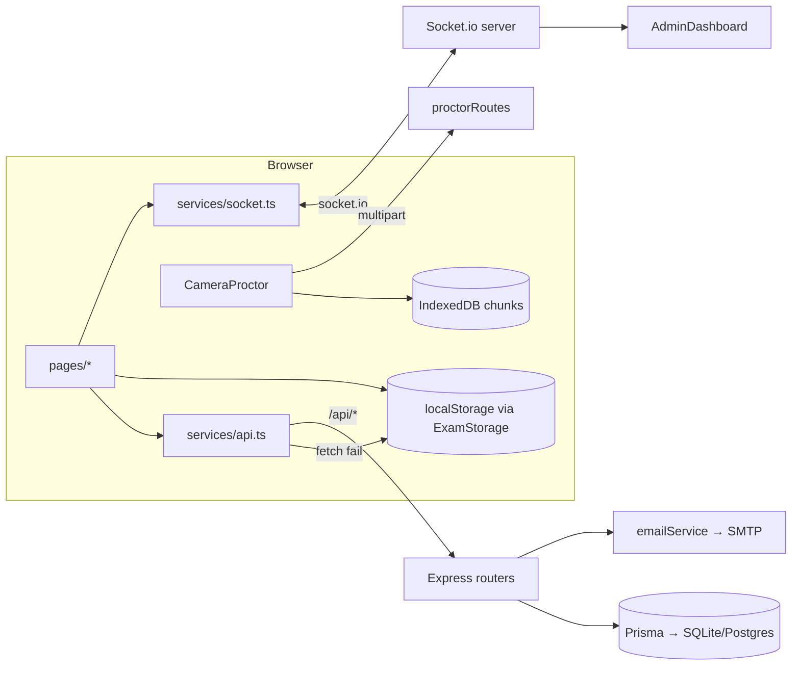

> [INDEX](../INDEX.md) > Guides > Architecture

# 02 — Architecture

Two packages, one process in production. Full constraints in
[`../../AGENTS.md`](../../AGENTS.md); this is the picture.

## Request lifecycle (candidate submit)

1. `Exam.tsx` assembles `answers`, calls `releaseCamera()`.
2. `CameraProctor` uploads video (`/api/proctor/upload-video`) and snapshot.
3. `api.submitExam()` → `POST /api/exam/submit`.
4. `examRoutes` re-scores from DB, upserts `Candidate`, creates
   `ExamAttempt`, calls `sendExamCompletionAlert`, returns the attempt.
5. `socketService.emitExamSubmitted` → server rebroadcasts
   `admin:exam_submitted`.
6. `ExamResults.tsx` renders the server object.

## Trust boundaries

- Client → server: `answers`, identity fields, `tabSwitches`, and
  `proctoringStatus` are **claims**. Score and pass/fail are computed
  server-side. `tabSwitches` is not verifiable and is stored as reported.
- Admin: JWT in `sessionStorage`, verified by `authenticateAdmin`.
- Anything under `/uploads` and every `GET` under `/api` is currently
  public — `TODO.md` Phase 8.

## Why it looks like this

[decisions/](../decisions/README.md) — ADR 001 (server scoring), 002
(no router), 003 (single container), 005 (fallback), 006 (recording).
